# MSDN

This is an anonymous project website of paper "**MSDN: Mutually Semantic Distillation Network for Zero-Shot Learning**" submitted to *CVPR'22*. This website includes the following materials for testing and checking our results reported in our paper:

1. The trained model
2. The test scripts
3. The t-SNE visualization of visual features on **CUB**, **SUN** and **AWA2**. 
4. More visualization of attention maps.

## Preparing Dataset and Model

We provide trained models ([Google Drive](https://drive.google.com/drive/folders/1IBGfPXleu4E2BLTI4TlUL1jYSuwahbYC?usp=sharing)) on three different datasets: [CUB](http://www.vision.caltech.edu/visipedia/CUB-200-2011.html), [SUN](http://cs.brown.edu/~gmpatter/sunattributes.html), [AWA2](http://cvml.ist.ac.at/AwA2/) in the CZSL/GZSL setting. You can download model files as well as corresponding datasets, and organize them as follows: 
```
.
├── saved_model
│   ├── CUB_MSDN_CZSL.pth
│   ├── CUB_MSDN_GZSL.pth
│   ├── SUN_MSDN_CZSL.pth
│   ├── SUN_MSDN_GZSL.pth
│   ├── AWA2_MSDN_CZSL.pth
│   └── AWA2_MSDN_GZSL.pth
├── data
│   ├── CUB/
│   ├── SUN/
│   └── AWA2/
└── ···
```

## Requirements
The code implementation of **TransZero** mainly based on [PyTorch](https://pytorch.org/). All of our experiments run and test in Python 3.8.8. To install all required dependencies:
```
$ pip install -r requirements.txt
```
## Runing
Runing following commands and testing **MSDN** on different dataset:

CUB Dataset: 
```
$ python Test_CUB.py     
```
SUN Dataset:
```
$ python Test_SUN.py     
```
AWA2 Dataset: 
```
$ python Test_AWA2.py     
```

## Results
Results of our released models using various evaluation protocols on three datasets, both in the conventional ZSL (CZSL) and generalized ZSL (GZSL) settings.

| Dataset | Acc(CZSL) | U(GZSL) | S(GZSL) | H(GZSL) |
| :-----: | :-----: | :-----: | :-----: | :-----: |
| CUB | 76.1 | 68.7 | 67.5 | 68.1 |
| SUN | 65.8 | 52.2 | 34.2 | 41.3 |
| AWA2 | 70.1 | 62.0 | 74.5 | 67.7 |

**Note**: All of above results are run on a server with an AMD Ryzen 7 5800X CPU and a NVIDIA RTX A6000 GPU.

# Visualization Results
## t-SNE Visualizations
The t-SNE visualization of visual features for seen classes and unseen classes on three datasets, learned by the **"baseline"**, **"V->A"**, **"A->V"**, and **"V->A and A->V"**. The 10 colors denote 10 different seen/unseen classes randomly selected from each dataset.
### CUB Dataset: 
Seen Classes: 
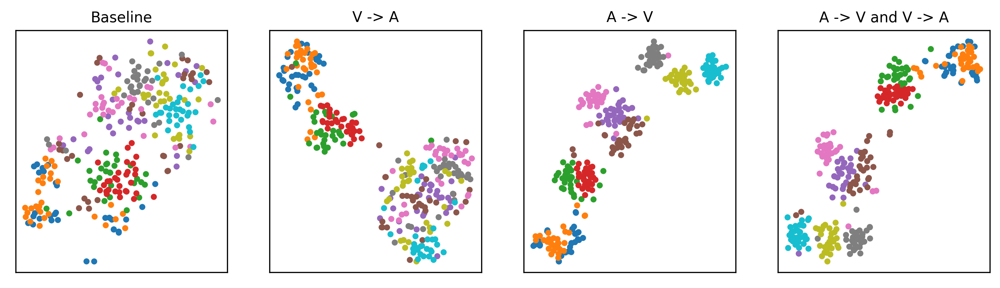
Unseen Classes: 
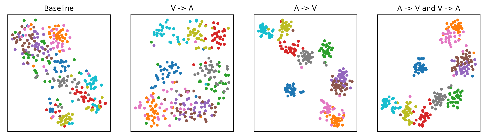

### SUN Dataset:
Seen Classes:  
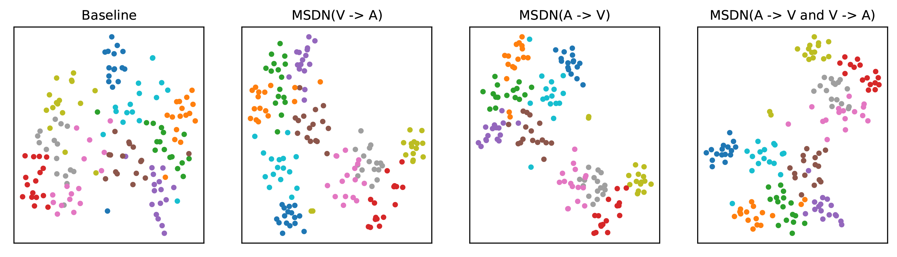
Unseen Class: 
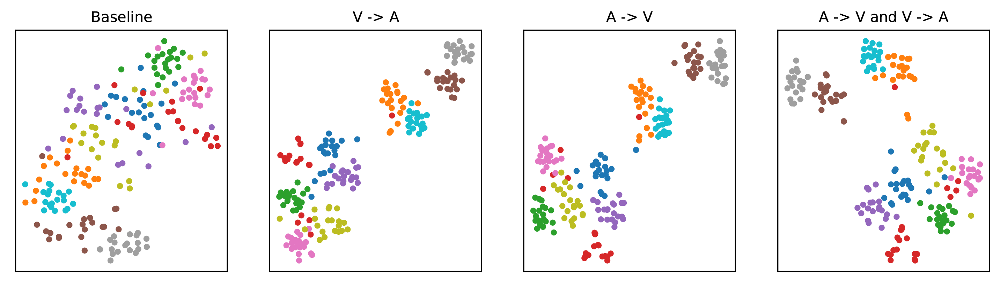

### AWA2 Dataset: 
Seen Classes: 
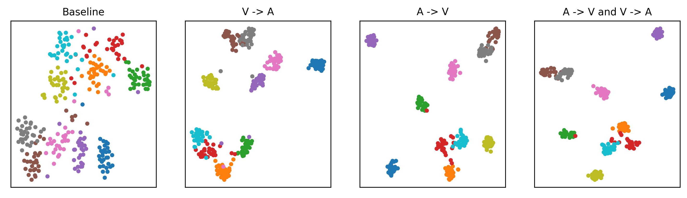
Unseen Classes: 
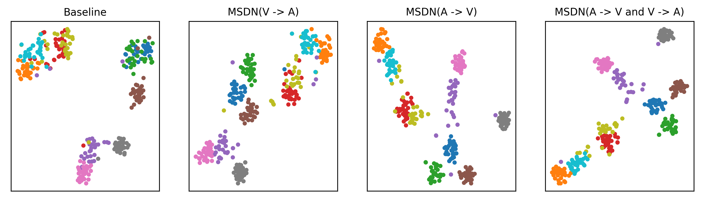

## Attention Maps
Visualization of attention maps for the two mutual attention sub-nets. For each group, the attention maps in the first row are learned by **Attribute->Visual subnet**, the attention maps in the second row  are learned by **Visual->Attribute subnet**. The scores are the attribute scores. 


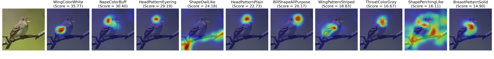
--------------------------------------------------------------------------------------------------------------------------------------------------------------------------------

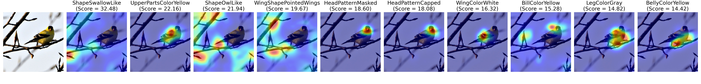
--------------------------------------------------------------------------------------------------------------------------------------------------------------------------------

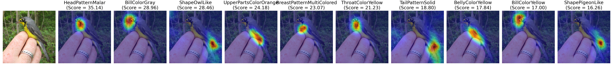
--------------------------------------------------------------------------------------------------------------------------------------------------------------------------------

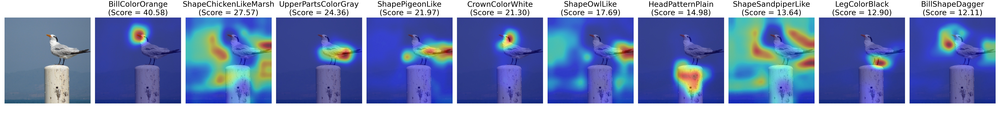
--------------------------------------------------------------------------------------------------------------------------------------------------------------------------------

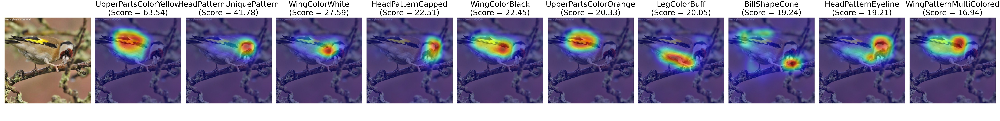
--------------------------------------------------------------------------------------------------------------------------------------------------------------------------------

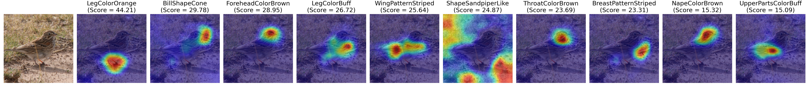
--------------------------------------------------------------------------------------------------------------------------------------------------------------------------------

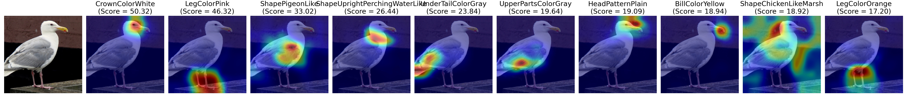
--------------------------------------------------------------------------------------------------------------------------------------------------------------------------------

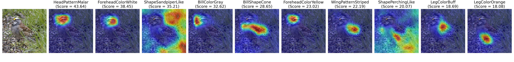
--------------------------------------------------------------------------------------------------------------------------------------------------------------------------------

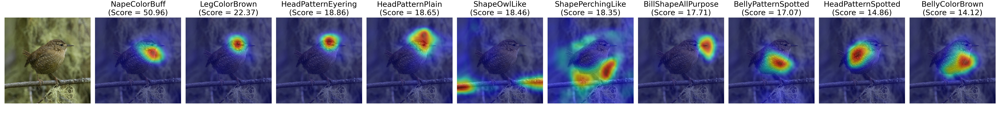
--------------------------------------------------------------------------------------------------------------------------------------------------------------------------------

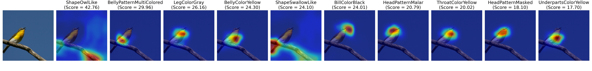
