# MSDN

This is anonymous project website of the paper "MSDN: Mutually Semantic Distillation Network for Zero-Shot Learning" submitted to CVPR 2022. This website includes the following materials for testing and checking our results reported in our paper:

1. The trained model
2. The test scripts
3. More visualization of attention maps.

## Preparing Dataset and Model

We provide trained models ([Google Drive](https://drive.google.com/drive/folders/1WK9pm2eX2Rl4rWqXqe_EZiAM8wWB8yqG?usp=sharing)) on three different datasets: [CUB](http://www.vision.caltech.edu/visipedia/CUB-200-2011.html), [SUN](http://cs.brown.edu/~gmpatter/sunattributes.html), [AWA2](http://cvml.ist.ac.at/AwA2/) in the CZSL/GZSL setting. You can download model files as well as corresponding datasets, and organize them as follows: 
```
.
├── saved_model
│   ├── TransZero_CUB_CZSL.pth
│   ├── TransZero_CUB_GZSL.pth
│   ├── TransZero_SUN_CZSL.pth
│   ├── TransZero_SUN_GZSL.pth
│   ├── TransZero_AWA2_CZSL.pth
│   └── TransZero_AWA2_GZSL.pth
├── data
│   ├── CUB/
│   ├── SUN/
│   └── AWA2/
└── ···
```

## Requirements
The code implementation of **TransZero** mainly based on [PyTorch](https://pytorch.org/). All of our experiments run and test in Python 3.8.8. To install all required dependencies:
```
$ pip install -r requirements.txt
```
## Runing
Runing following commands and testing **TransZero** on different dataset:

CUB Dataset: 
```
$ python Test_cub.py     
```
SUN Dataset:
```
$ python Test_sun.py     
```
AWA2 Dataset: 
```
$ python Test_awa2.py     
```

## Results
Results of our released models using various evaluation protocols on three datasets, both in the conventional ZSL (CZSL) and generalized ZSL (GZSL) settings.

| Dataset | Acc(CZSL) | U(GZSL) | S(GZSL) | H(GZSL) |
| :-----: | :-----: | :-----: | :-----: | :-----: |
| CUB | 75.7 | 68.7 | 67.5 | 68.1 |
| SUN | 65.6 | 51.8 | 34.3 | 41.3 |
| AWA2 | 68.1 | 60.8 | 74.6 | 67.0 |

**Note**: All of above results are run on a server with an AMD Ryzen 7 5800X CPU and a NVIDIA RTX A6000 GPU.

## Attention Maps

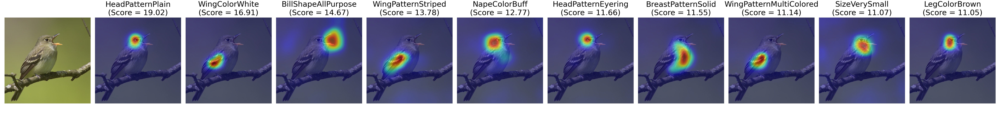
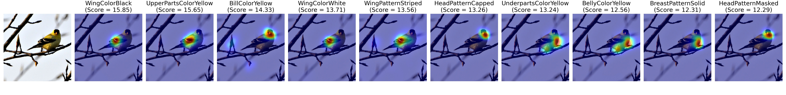
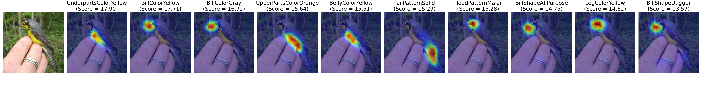
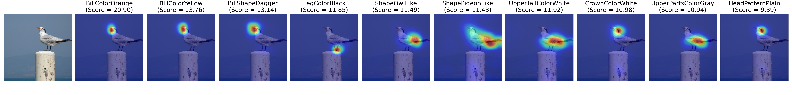
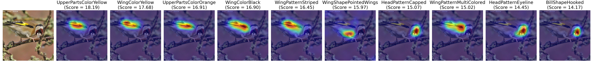
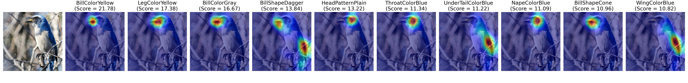
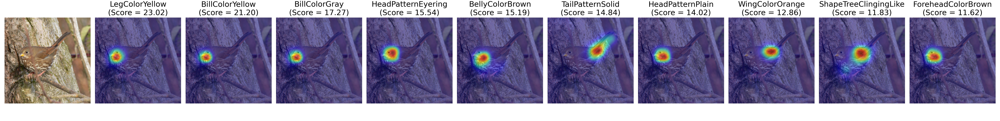
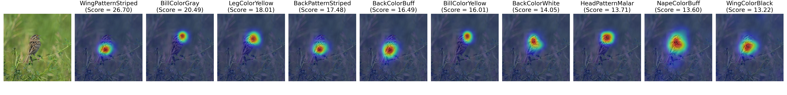
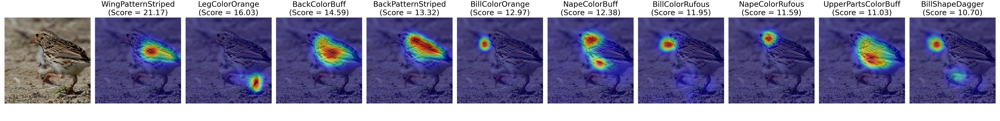
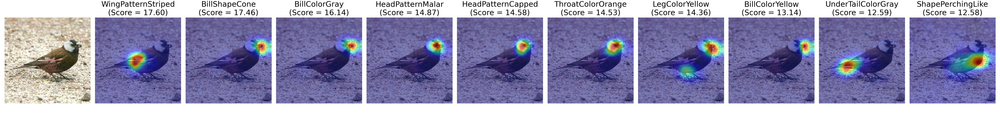
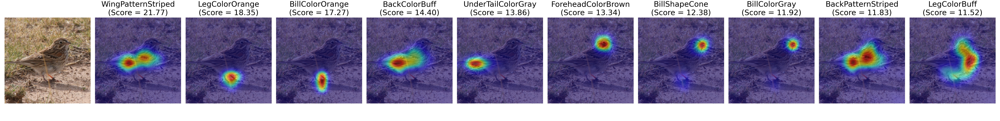
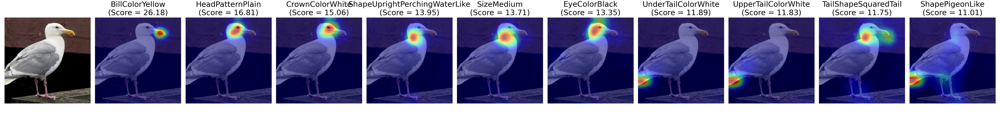
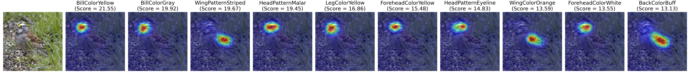
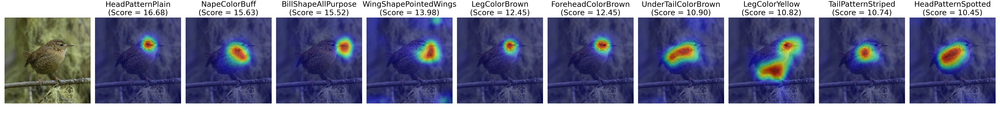
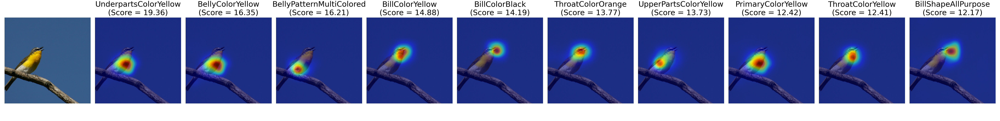
